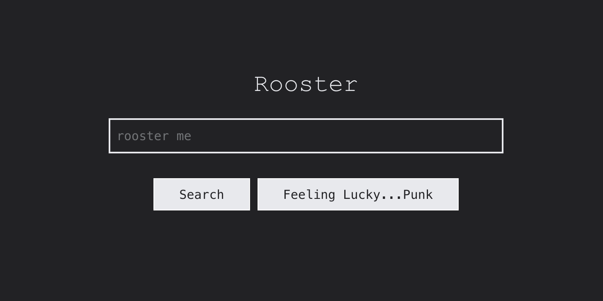

<div align="center">
   🐓
   <h3 align="center" style="font-size: 2.1em; font-weight: bolder;">Rooster</h3>

  <p align="center">
    A Java-Based Search Engine
    <br />
    <br />
    <a href="https://rooster-search-55efd4f04756.herokuapp.com/get_search">View Demo</a>
    ·
    <a href="https://github.com/nestrada2/Search-Engine/issues/new?labels=bug&template=bug-report.md">Report Bug</a>
    ·
    <a href="https://github.com/nestrada2/Search-Engine/issues/new?labels=enhancement&template=feature-request.md">Request Feature</a>
  </p>
</div>


<!-- ABOUT THE PROJECT -->
## 📖 About the Project



This project is a smaller-scale search engine designed to help users quickly find the information they seek using keywords. It indexes pages and returns a list of ranked results containing the word or phrase they were searching for.

### **🛠️ Tech Stack**
[![Java][Java.com]][Java-url]
<br />
[![Jetty][Jetty.com]][Jetty-url]
<br />
[![Terminal CSS][Terminal CSS.com]][Terminal CSS-url]
<br />


<!-- GETTING STARTED -->
## 📦 Getting Started

### **💾 Installation**
   ```sh
   git clone https://github.com/nestrada2/Search-Engine.git
   ```

### **▶️ Running the Program**
   ```sh
   java Driver [options]
   ```

   **⚙️ Options**
   - 📂 **-text [path]**
     - Path to a single file or directory of text files to add to the inverted index. If a directory is specified, all .txt and .text files in its subdirectories are added.
     - **Example**: 
       - `-text "input/text/simple/hello.txt"`
       - `-text "input/text/simple/"`
   - 📄 **-index [path]**
     - Indicates the inverted index should be output to a JSON file. If a path is specified, It is the path to use for the output file. Defaults to `index.json` if not provided. 
     - **Example**:
       - `-index "actual/index-simple-hello.json"`
   - 📊 **-counts [path]**
     - Saves word counts to the specified file path (default is `counts.json`).
     - **Example**:
       - `-counts wordcounts.json`
   - 📝 **-query [path]**
     - Path to a file of search queries. No search is performed if not provided.
     - **Example**:
       - `-query "input/query/simple.txt"`
   - 🔎 **-exact**
     - Specifies that searches should be exact search (defaults to partial search if not provided).
   - 📈 **-results [path]**
     - Saves search results to the specified file path (default is `results.json`).
     - **Example**:
       - `-results actual/search-exact-simple.json`
   - 🧵 **-threads [num]**
     - Enables multithreading with the specified number of threads (defaults to 5 if [num] argument is not provided, not a number, or less than 1).
     - **Example**:
       - `-threads 3`
   - 🌐 **-html [seed]**
     - The seed URL for the web crawler to start building the inverted index.
     - **Example**:
       - `-html "https://usf-cs272-fall2022.github.io/project-web/input/simple/"`
   - 🔍 **-max [total]**
     - Sets the maximum number of URLs to crawl (including the seed URL) when building the index (default is 1).
     - **Example**:
       - `-max 15`
   - 🖥️ **-server [port]**
     - Starts a multithreaded search engine web server on the specified port (default is `8080`).
      - **Example**:
        - `-server 8080`


<!-- Usage -->
## 🏗️ Usage

### **📋 Examples**
- **🧵 Run in Single-Threaded Mode (No Server or Crawling)**
   ```sh
      java Driver
   ```

- **📄 Build an Inverted Index from a Text File**
   ```sh
      java Driver -text "input/text/simple/hello.txt" -index "actual/index-simple-hello.json"
   ```

- **🔍📁 Perform Search with Queries from a File, Exact Search, and Save Results**
   ```sh
      java Driver -text "input/text/simple/" -query "input/query/simple.txt" -exact -results actual/search-exact-simple.json
   ```

- **🔍📂🔄 Perform Search with Queries from a File, Partial Search, Save Results, and Enable Multithreading**
   ```sh
      java Driver -text "input/text/simple/" -query "input/query/simple.txt" -results actual/search-exact-simple.json -threads 3
   ```

- **🌐🔄📁 Web Crawl with Multithreading and Save Inverted Index to File**
   ```sh
      java Driver -html "https://usf-cs272-fall2022.github.io/project-web/input/simple/" -max 15 -threads 3 -index index-crawl.json
   ```

- **🌐💻🔍 Web Crawl with Multithreading and Run Server for User to Start Searching**
   ```sh
      java Driver -html "https://usf-cs272-fall2022.github.io/project-web/input/simple/" -max 15 -threads 3 -server 8080
   ```


<!-- LICENSE -->
## 📜 License
Distributed under the MIT License. See [`LICENSE.txt`](LICENSE.txt) for more information.

<!-- RESOURCES -->
## 📚 Resources
[Oracle](https://docs.oracle.com/javase/7/docs/api/overview-summary.html), 
[Jetty](https://jetty.org/docs/index.html),
[Stack Overflow](https://stackoverflow.com/),
[W3 School](https://www.w3schools.com/),
[MDN](https://developer.mozilla.org/en-US/),
[Geeks for Geeks](https://www.geeksforgeeks.org/),
[Terminal CSS](https://terminalcss.xyz/),
[Regex 101](https://regex101.com/)

<!------- MARKDOWN LINKS & IMAGES ------->
[Java.com]: https://img.shields.io/badge/Java-ED8B00?style=for-the-badge&logo=openjdk&logoColor=white
[Java-url]: https://www.java.com/en/
[Jetty.com]: https://img.shields.io/badge/Jetty-E23237?style=for-the-badge&logo=angularjs&logoColor=white
[Jetty-url]: https://jetty.org/docs/index.html
[Terminal CSS.com]: https://img.shields.io/badge/Terminal_CSS-100000?style=for-the-badge&logo=Terminal_CSS
[Terminal CSS-url]: https://terminalcss.xyz/
